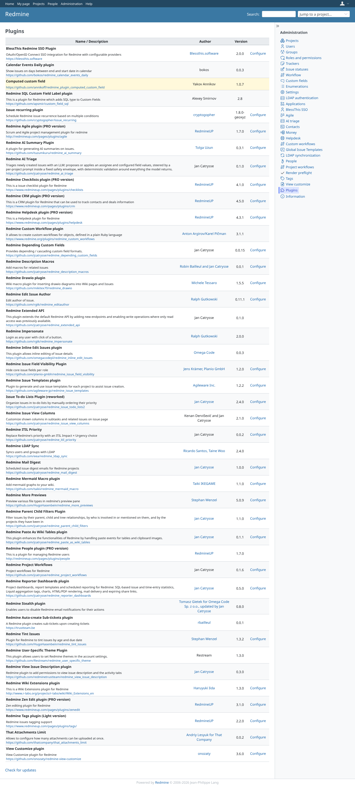
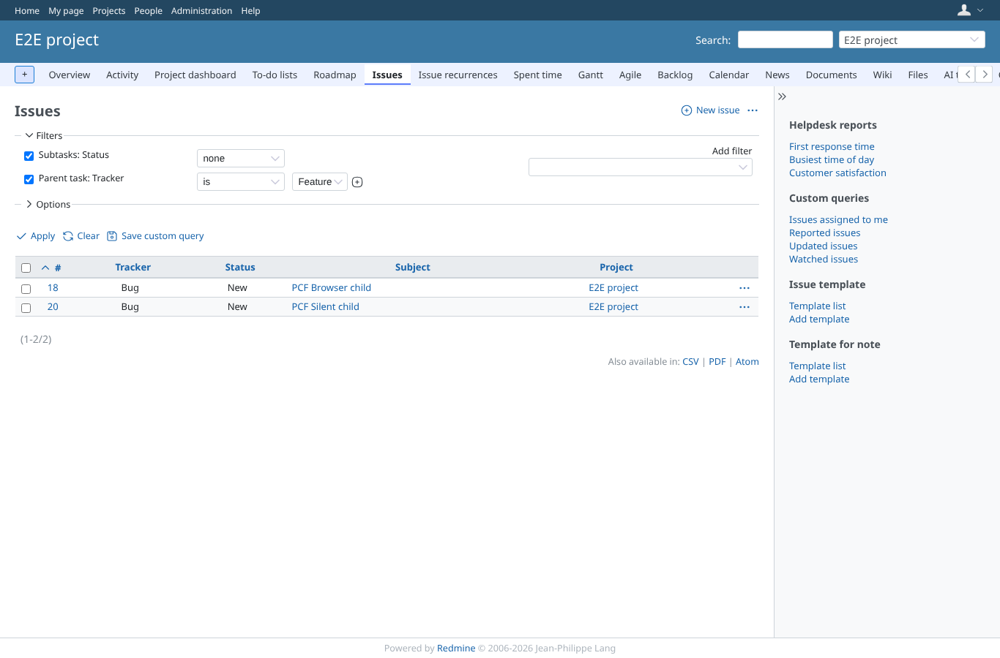
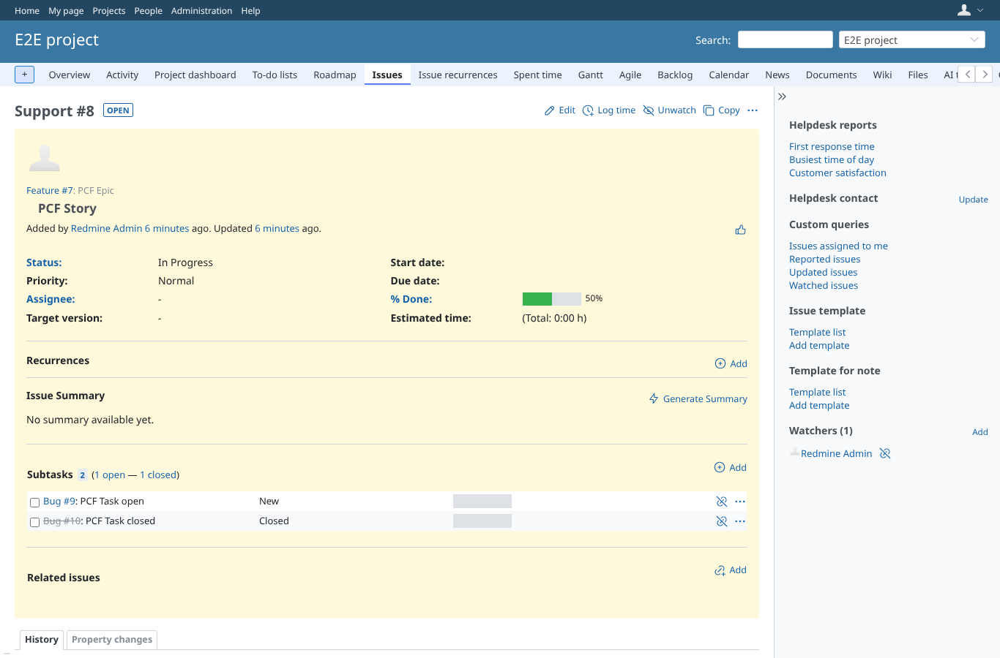
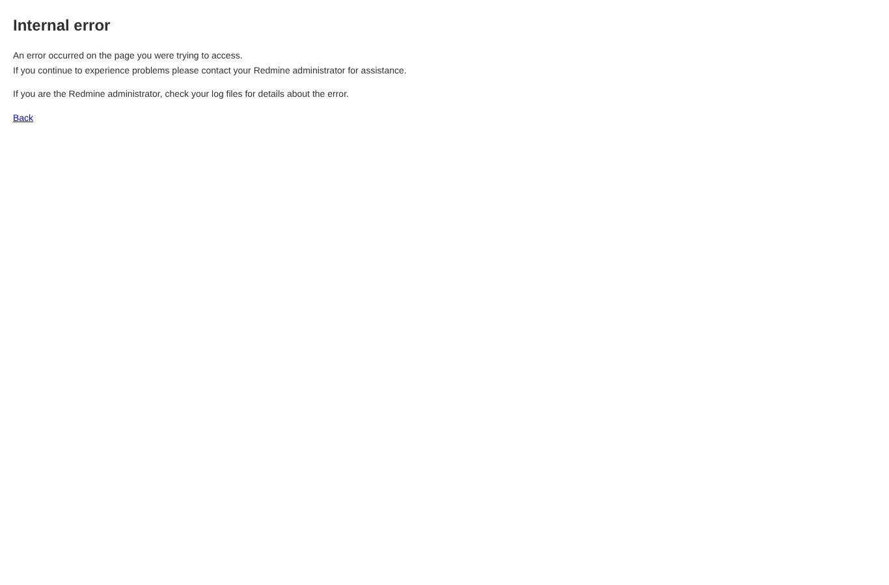
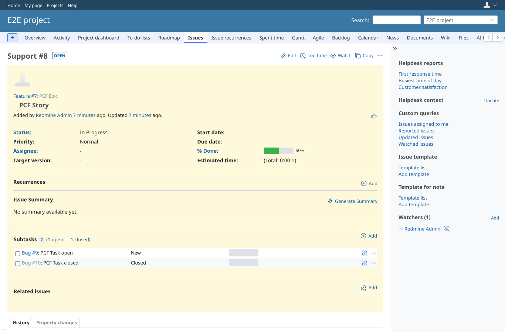

# core-pages

Run 2026-10-07T16:34:57.288Z against http://127.0.0.1:3070.

| screenshot | user | URL | shows |
|---|---|---|---|
|  | admin | `/admin/plugins` | Administration > Plugins: 43 plugin(s) installed in this run. |
|  | admin | `/projects/e2e-project/settings` | Project > Settings as admin: 200. |
|  | admin | `/projects/e2e-project/issues?set_filter=1&sort=id&per_page=100&c%5B%5D=tracker&c%5B%5D=status&c%5B%5D=subject&c%5B%5D=project&f%5B%5D=&f%5B%5D=child_status_id&op%5Bchild_status_id%5D=%21*&f%5B%5D=parent_tracker_id&op%5Bparent_tracker_id%5D=%3D&v%5Bparent_tracker_id%5D%5B%5D=2` | Issue list as admin with two of the plugin's filters (Subtasks: Status none, Parent task: Tracker is Feature): 200. |
|  | admin | `/issues/8` | Issue page of PCF Story as admin: 200. |
|  | manager | `/projects/e2e-project/settings` | Project > Settings as manager: 200. |
|  | manager | `/projects/e2e-project/issues?set_filter=1&sort=id&per_page=100&c%5B%5D=tracker&c%5B%5D=status&c%5B%5D=subject&c%5B%5D=project&f%5B%5D=&f%5B%5D=child_status_id&op%5Bchild_status_id%5D=%21*&f%5B%5D=parent_tracker_id&op%5Bparent_tracker_id%5D=%3D&v%5Bparent_tracker_id%5D%5B%5D=2` | Issue list as manager with two of the plugin's filters (Subtasks: Status none, Parent task: Tracker is Feature): 200. |
|  | manager | `/issues/8` | Issue page of PCF Story as manager: 200. |
|  | reporter | `/projects/e2e-project/settings` | Project > Settings as reporter (no "Manage project"): 403, refused rather than broken. |
|  | reporter | `/issues/8` | Issue page as reporter: 200. |
|  | outsider | `/projects/e2e-private/settings` | Project > Settings of the private project as outsider: 403. |

## Problems

- /projects/e2e-project/settings as admin: HTTP 500, expected 200
- /projects/e2e-project/settings as manager: HTTP 500, expected 200
- /issues/8 as reporter: HTTP 403, expected 200
