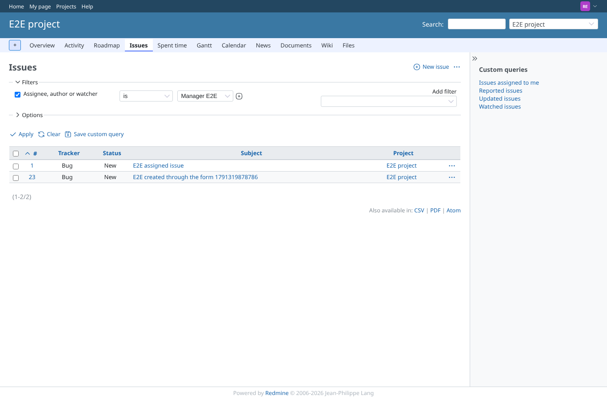
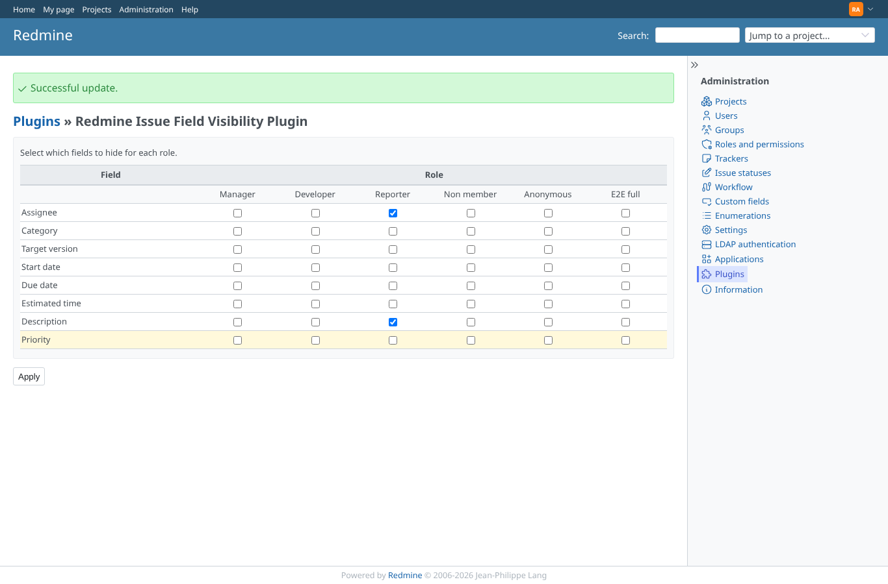
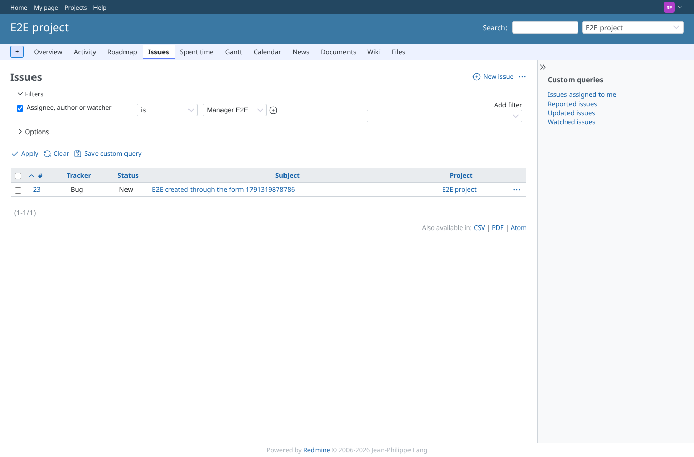
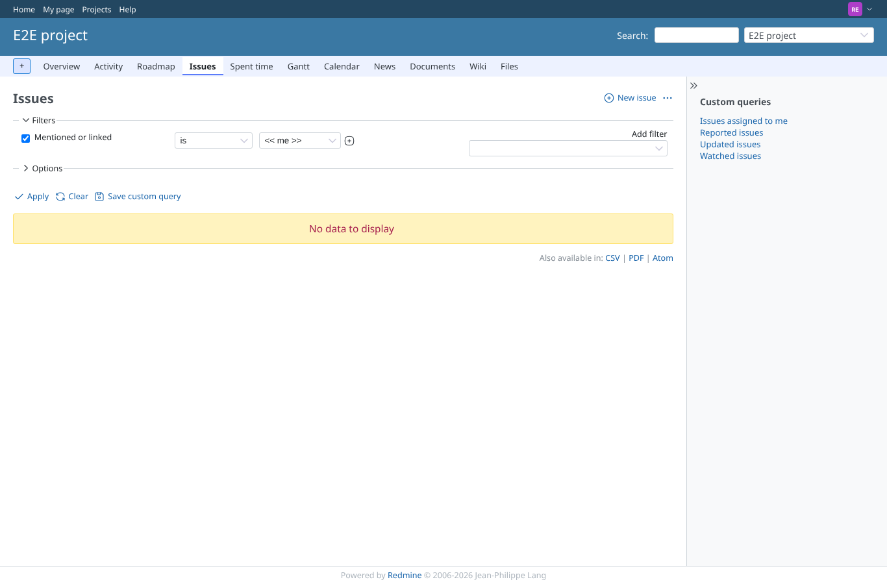
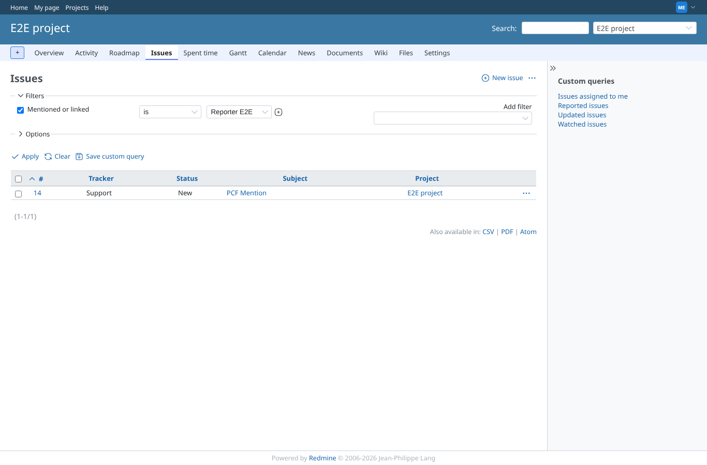
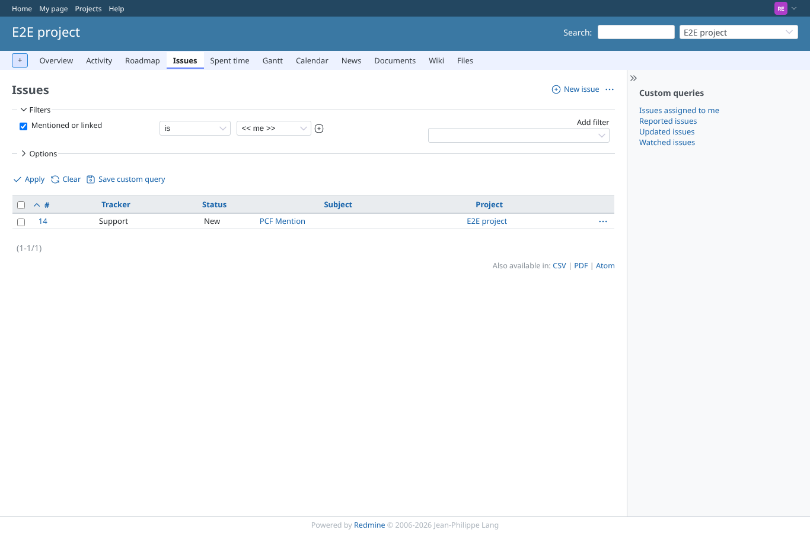

# hidden-fields

Run 2026-10-06T20:52:08.665Z against http://127.0.0.1:3000.

| screenshot | user | URL | shows |
|---|---|---|---|
|  | reporter | `/projects/e2e-project/issues?set_filter=1&sort=id&per_page=100&c%5B%5D=tracker&c%5B%5D=status&c%5B%5D=subject&c%5B%5D=project&f%5B%5D=&f%5B%5D=involved_id&op%5Binvolved_id%5D=%3D&v%5Binvolved_id%5D%5B%5D=5` | Fields visible: as reporter, "Assignee, author or watcher" is manager finds "E2E assigned issue" (assigned to manager). Result: no PCF issue. |
|  | admin | `/settings/plugin/redmine_issue_field_visibility` | redmine_issue_field_visibility: Assignee and Description hidden from the Reporter role. |
|  | reporter | `/projects/e2e-project/issues?set_filter=1&sort=id&per_page=100&c%5B%5D=tracker&c%5B%5D=status&c%5B%5D=subject&c%5B%5D=project&f%5B%5D=&f%5B%5D=involved_id&op%5Binvolved_id%5D=%3D&v%5Binvolved_id%5D%5B%5D=5` | Assignee hidden: as reporter, "Assignee, author or watcher" is manager no longer finds "E2E assigned issue"; the assignee cannot be read back through this filter. Result: no PCF issue. |
|  | reporter | `/projects/e2e-project/issues?set_filter=1&sort=id&per_page=100&c%5B%5D=tracker&c%5B%5D=status&c%5B%5D=subject&c%5B%5D=project&f%5B%5D=&f%5B%5D=mentioned_id&op%5Bmentioned_id%5D=%3D&v%5Bmentioned_id%5D%5B%5D=me` | Description hidden: as reporter, "Mentioned or linked" is << me >> no longer finds PCF Mention, whose mention is in the description. Result: no PCF issue. |
|  | manager | `/projects/e2e-project/issues?set_filter=1&sort=id&per_page=100&c%5B%5D=tracker&c%5B%5D=status&c%5B%5D=subject&c%5B%5D=project&f%5B%5D=&f%5B%5D=mentioned_id&op%5Bmentioned_id%5D=%3D&v%5Bmentioned_id%5D%5B%5D=6` | Manager (role E2E full, nothing hidden): "Mentioned or linked" is reporter still finds PCF Mention. Result: PCF Mention. |
|  | reporter | `/projects/e2e-project/issues?set_filter=1&sort=id&per_page=100&c%5B%5D=tracker&c%5B%5D=status&c%5B%5D=subject&c%5B%5D=project&f%5B%5D=&f%5B%5D=mentioned_id&op%5Bmentioned_id%5D=%3D&v%5Bmentioned_id%5D%5B%5D=me` | Fields shown again: as reporter, "Mentioned or linked" is << me >> finds PCF Mention again. Result: PCF Mention. |
