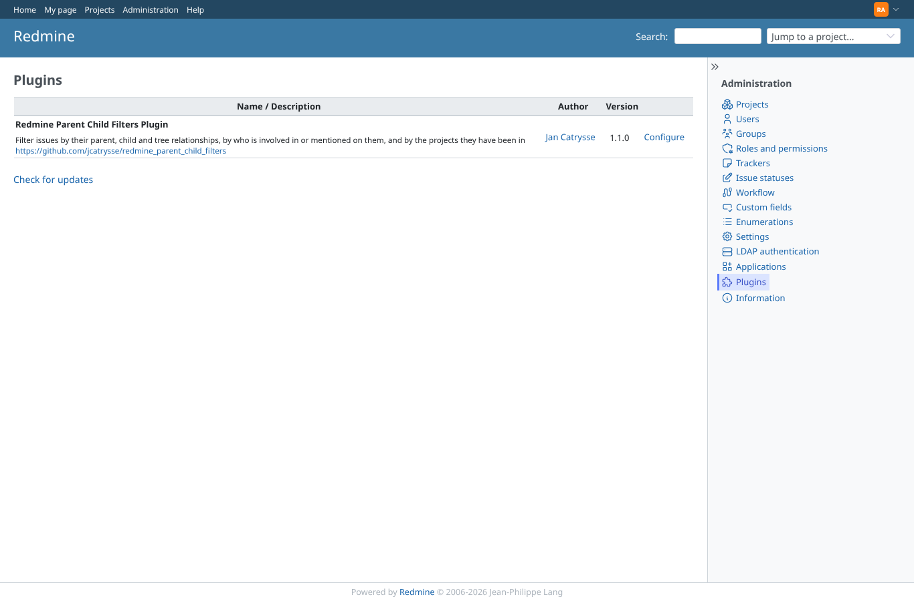

# hidden-fields

Run 2026-10-07T17:08:05.145Z against http://127.0.0.1:3000.

| screenshot | user | URL | shows |
|---|---|---|---|
|  | admin | `/admin/plugins` | redmine_issue_field_visibility is not installed here: nothing to combine with, scenario skipped. |
