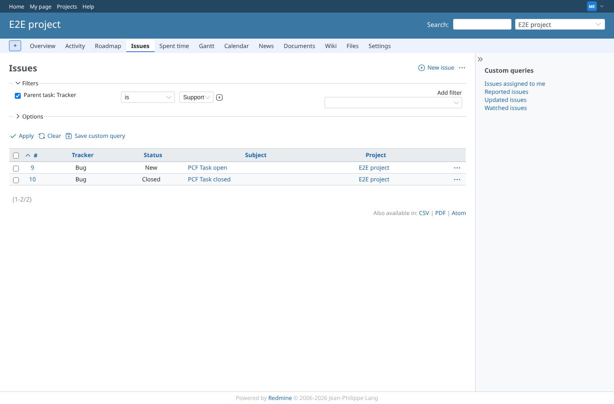
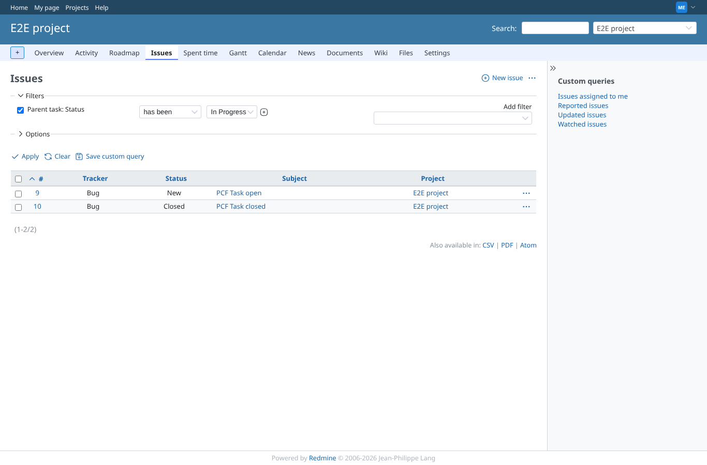
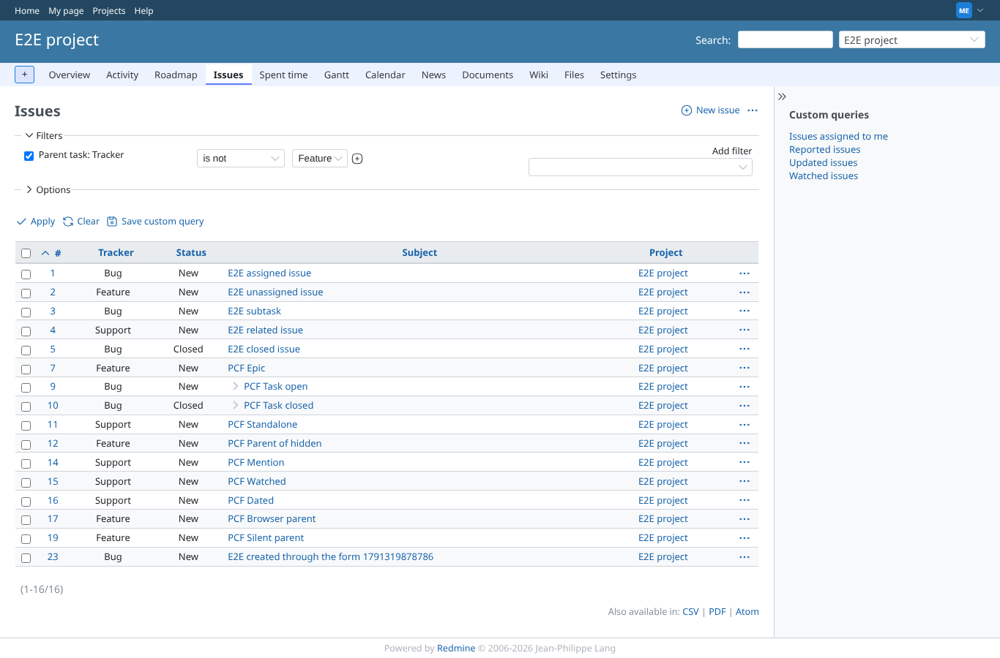
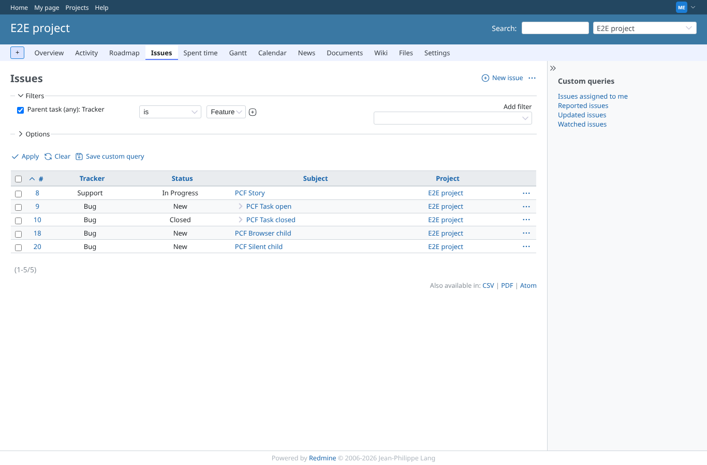
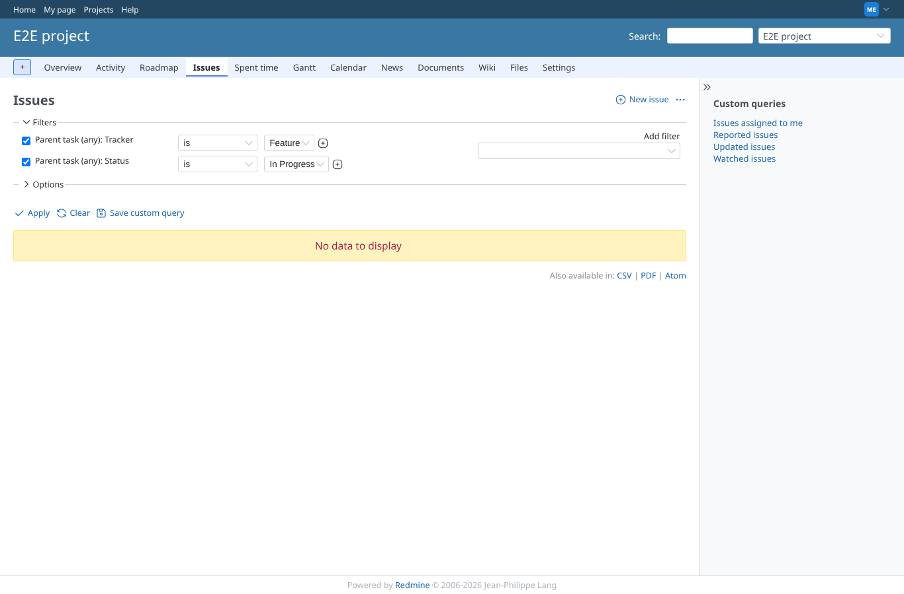
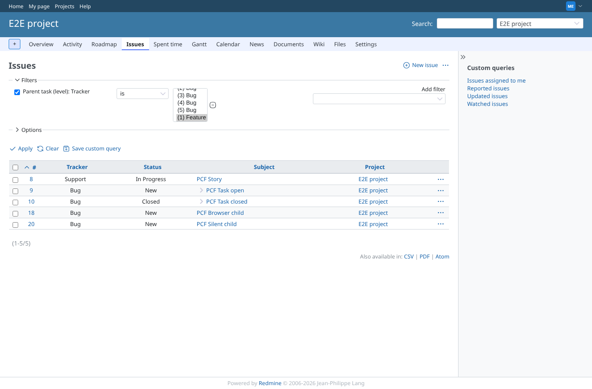
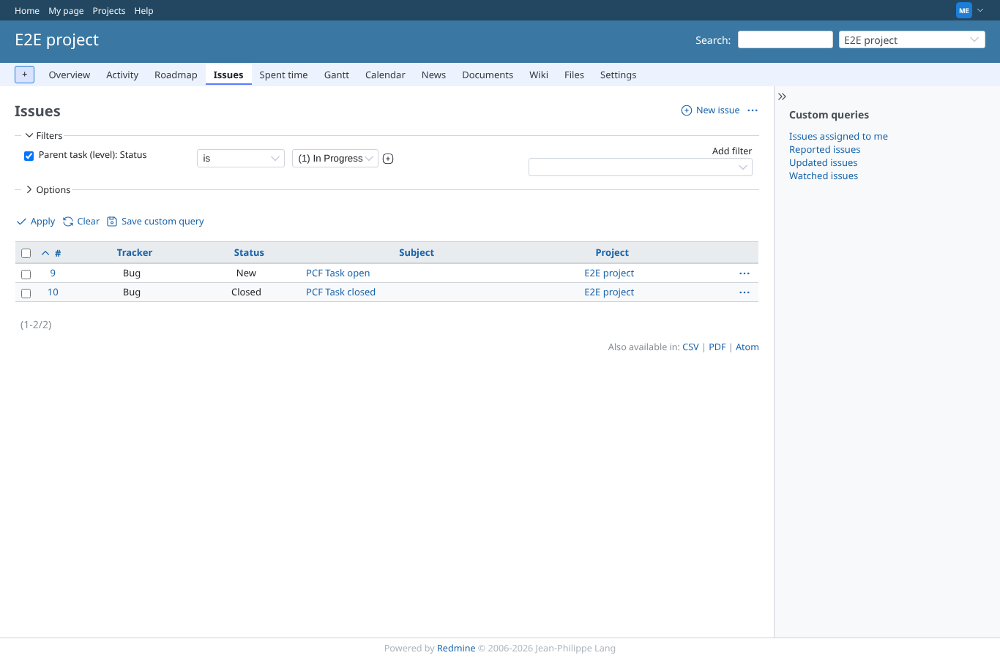
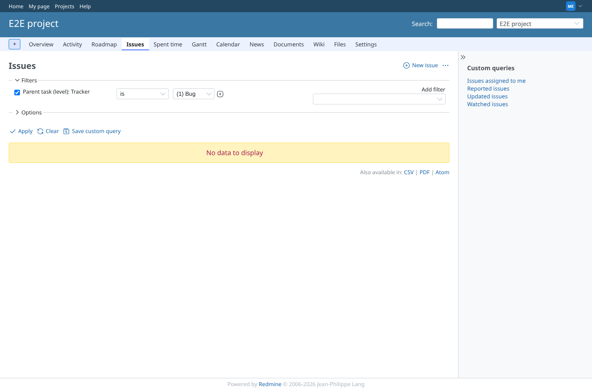
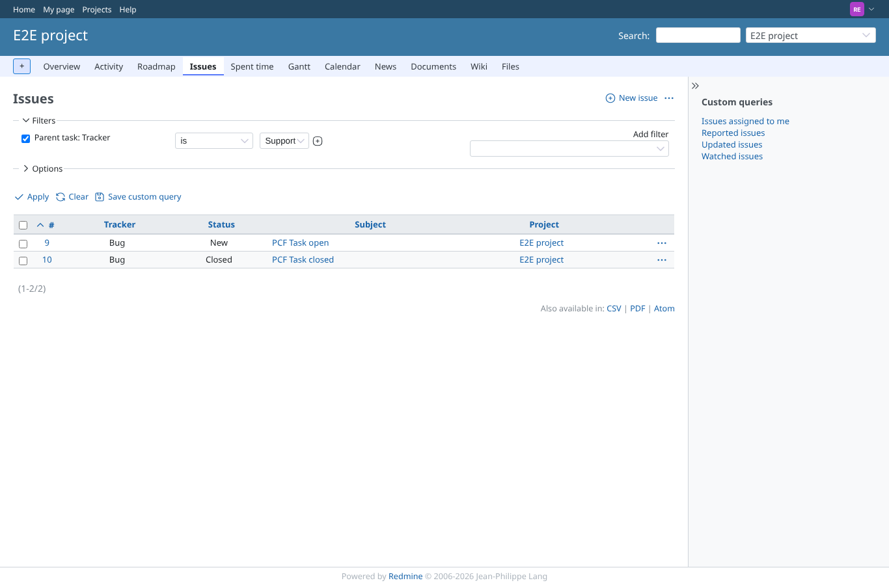

# parent-filters

Run 2026-10-06T20:52:20.839Z against http://127.0.0.1:3000.

| screenshot | user | URL | shows |
|---|---|---|---|
|  | manager | `/projects/e2e-project/issues?set_filter=1&sort=id&per_page=100&c%5B%5D=tracker&c%5B%5D=status&c%5B%5D=subject&c%5B%5D=project&f%5B%5D=&f%5B%5D=parent_tracker_id&op%5Bparent_tracker_id%5D=%3D&v%5Bparent_tracker_id%5D%5B%5D=3` | Parent task: Tracker is Support: the two tasks below the Support story, nothing else. Result: PCF Task closed, PCF Task open. |
|  | manager | `/projects/e2e-project/issues?set_filter=1&sort=id&per_page=100&c%5B%5D=tracker&c%5B%5D=status&c%5B%5D=subject&c%5B%5D=project&f%5B%5D=&f%5B%5D=parent_status_id&op%5Bparent_status_id%5D=%3D&v%5Bparent_status_id%5D%5B%5D=2` | Parent task: Status is In Progress: the tasks of the story that is in progress. Result: PCF Task closed, PCF Task open. |
|  | manager | `/projects/e2e-project/issues?set_filter=1&sort=id&per_page=100&c%5B%5D=tracker&c%5B%5D=status&c%5B%5D=subject&c%5B%5D=project&f%5B%5D=&f%5B%5D=parent_status_id&op%5Bparent_status_id%5D=ev&v%5Bparent_status_id%5D%5B%5D=2` | Parent task: Status has been In Progress (Redmine's history operator on a plugin filter). Result: PCF Task closed, PCF Task open. |
|  | manager | `/projects/e2e-project/issues?set_filter=1&sort=id&per_page=100&c%5B%5D=tracker&c%5B%5D=status&c%5B%5D=subject&c%5B%5D=project&f%5B%5D=&f%5B%5D=parent_tracker_id&op%5Bparent_tracker_id%5D=%21&v%5Bparent_tracker_id%5D%5B%5D=2` | Parent task: Tracker is not Feature: the story (parent is a Feature) is out; issues without a parent are in. Result: PCF Browser parent, PCF Dated, PCF Epic, PCF Mention, PCF Parent of hidden, PCF Silent parent, PCF Standalone, PCF Task closed, PCF Task open, PCF Watched. |
|  | manager | `/projects/e2e-project/issues?set_filter=1&sort=id&per_page=100&c%5B%5D=tracker&c%5B%5D=status&c%5B%5D=subject&c%5B%5D=project&f%5B%5D=&f%5B%5D=a_parent_tracker_id&op%5Ba_parent_tracker_id%5D=%3D&v%5Ba_parent_tracker_id%5D%5B%5D=2` | Parent task (any): Tracker is Feature: everything below a Feature at any level. Result: PCF Browser child, PCF Silent child, PCF Story, PCF Task closed, PCF Task open. |
|  | manager | `/projects/e2e-project/issues?set_filter=1&sort=id&per_page=100&c%5B%5D=tracker&c%5B%5D=status&c%5B%5D=subject&c%5B%5D=project&f%5B%5D=&f%5B%5D=a_parent_tracker_id&op%5Ba_parent_tracker_id%5D=%3D&v%5Ba_parent_tracker_id%5D%5B%5D=2&f%5B%5D=a_parent_status_id&op%5Ba_parent_status_id%5D=%3D&v%5Ba_parent_status_id%5D%5B%5D=2` | Parent task (any): Tracker is Feature AND Status is In Progress describe one ancestor: no Feature ancestor is in progress, so nothing matches. Result: no PCF issue. |
|  | manager | `/projects/e2e-project/issues?set_filter=1&sort=id&per_page=100&c%5B%5D=tracker&c%5B%5D=status&c%5B%5D=subject&c%5B%5D=project&f%5B%5D=&f%5B%5D=a_specific_parent_tracker_id&op%5Ba_specific_parent_tracker_id%5D=%3D&v%5Ba_specific_parent_tracker_id%5D%5B%5D=2%3A2` | Parent task (level): Tracker is "(2) Feature": the grandchildren of the epic only. Result: PCF Task closed, PCF Task open. |
|  | manager | `/projects/e2e-project/issues?set_filter=1&sort=id&per_page=100&c%5B%5D=tracker&c%5B%5D=status&c%5B%5D=subject&c%5B%5D=project&f%5B%5D=&f%5B%5D=a_specific_parent_tracker_id&op%5Ba_specific_parent_tracker_id%5D=%3D&v%5Ba_specific_parent_tracker_id%5D%5B%5D=2%3A1&v%5Ba_specific_parent_tracker_id%5D%5B%5D=2%3A2` | Parent task (level): Tracker "(1) Feature" or "(2) Feature": each depth on its own, the story and the tasks (the multi-select shows the first selected value). Result: PCF Browser child, PCF Silent child, PCF Story, PCF Task closed, PCF Task open. |
|  | manager | `/projects/e2e-project/issues?set_filter=1&sort=id&per_page=100&c%5B%5D=tracker&c%5B%5D=status&c%5B%5D=subject&c%5B%5D=project&f%5B%5D=&f%5B%5D=a_specific_parent_status_id&op%5Ba_specific_parent_status_id%5D=%3D&v%5Ba_specific_parent_status_id%5D%5B%5D=2%3A1` | Parent task (level): Status is "(1) In Progress": the tasks whose direct parent is in progress. Result: PCF Task closed, PCF Task open. |
|  | manager | `/projects/e2e-project/issues?set_filter=1&sort=id&per_page=100&c%5B%5D=tracker&c%5B%5D=status&c%5B%5D=subject&c%5B%5D=project&f%5B%5D=&f%5B%5D=a_specific_parent_tracker_id&op%5Ba_specific_parent_tracker_id%5D=%3D&v%5Ba_specific_parent_tracker_id%5D%5B%5D=2%3A99` | Parent task (level) "2:99", a depth far above the ceiling of 10, typed into the URL: refused quietly, no PCF issue, no error. Result: no PCF issue. (The value box shows its first option: the value from the URL is not one of them.) |
|  | manager | `/projects/e2e-project/issues?set_filter=1&sort=id&per_page=100&c%5B%5D=tracker&c%5B%5D=status&c%5B%5D=subject&c%5B%5D=project&f%5B%5D=&f%5B%5D=a_specific_parent_tracker_id&op%5Ba_specific_parent_tracker_id%5D=%3D&v%5Ba_specific_parent_tracker_id%5D%5B%5D=x%3BDROP` | Parent task (level) "x;DROP": not a tracker and depth; the page answers normally with no PCF issue. Result: no PCF issue. (The value box shows its first option: the value from the URL is not one of them.) |
|  | reporter | `/projects/e2e-project/issues?set_filter=1&sort=id&per_page=100&c%5B%5D=tracker&c%5B%5D=status&c%5B%5D=subject&c%5B%5D=project&f%5B%5D=&f%5B%5D=parent_tracker_id&op%5Bparent_tracker_id%5D=%3D&v%5Bparent_tracker_id%5D%5B%5D=3` | As reporter (core Reporter role): Parent task: Tracker is Support gives the same two tasks. Result: PCF Task closed, PCF Task open. |
