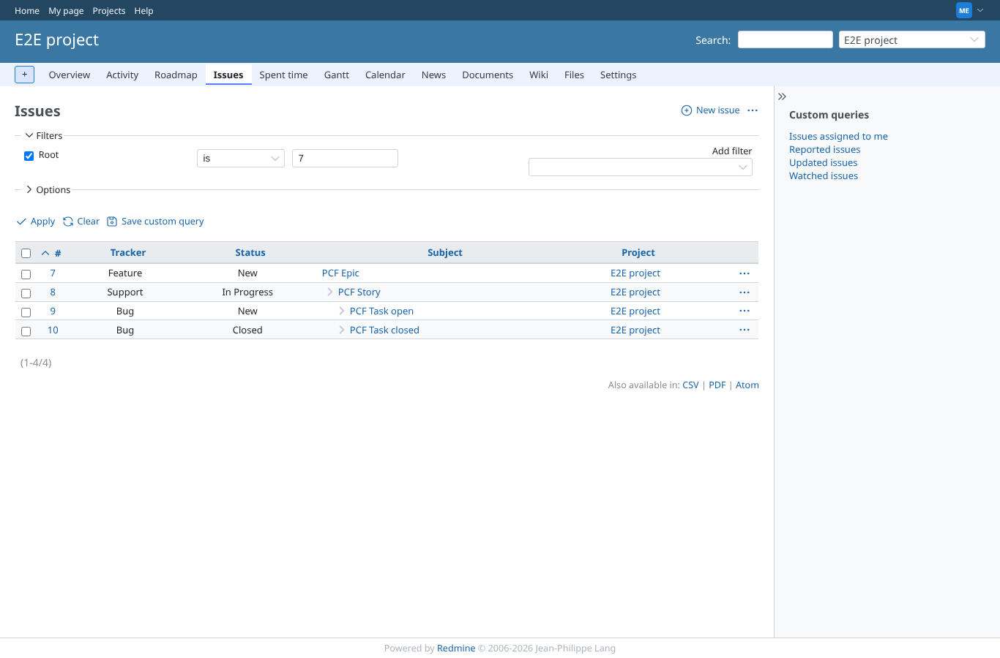
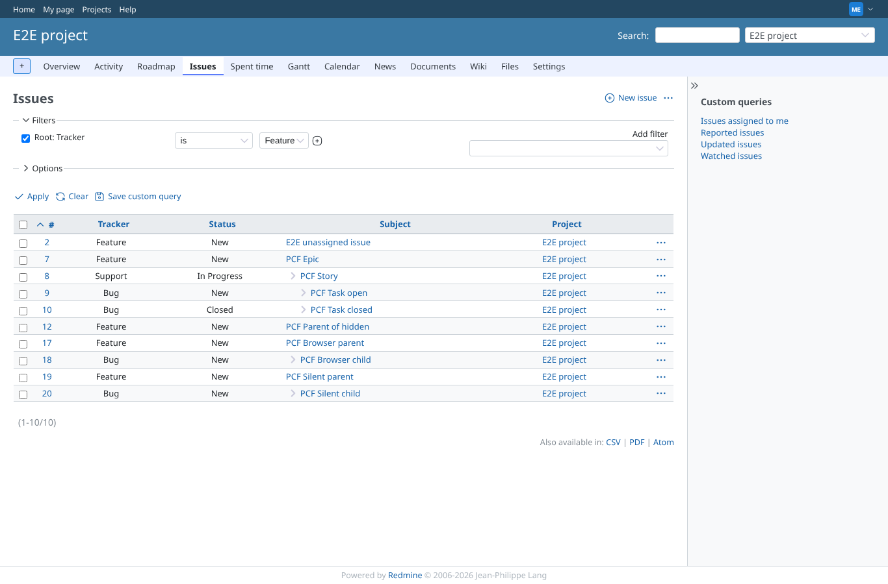
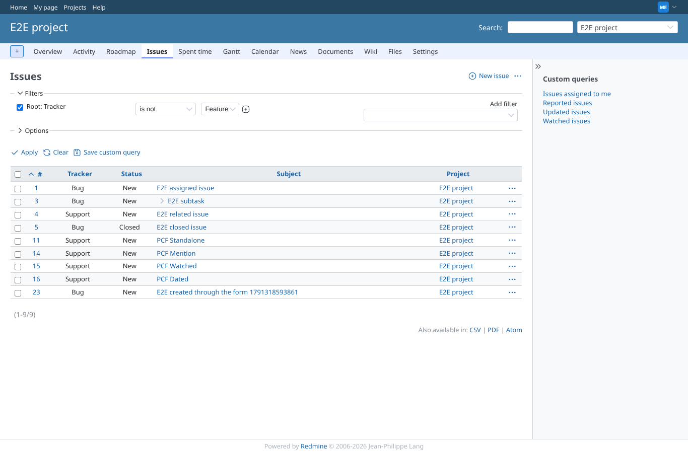
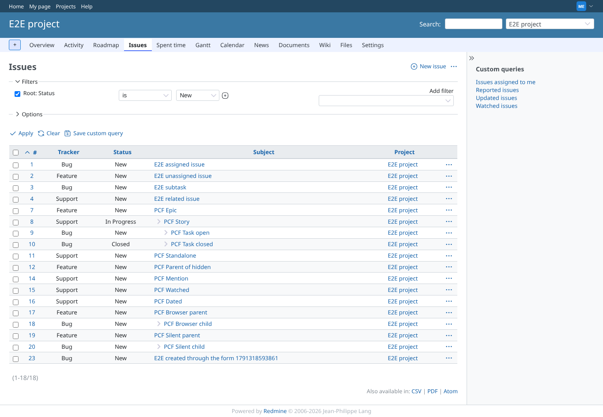
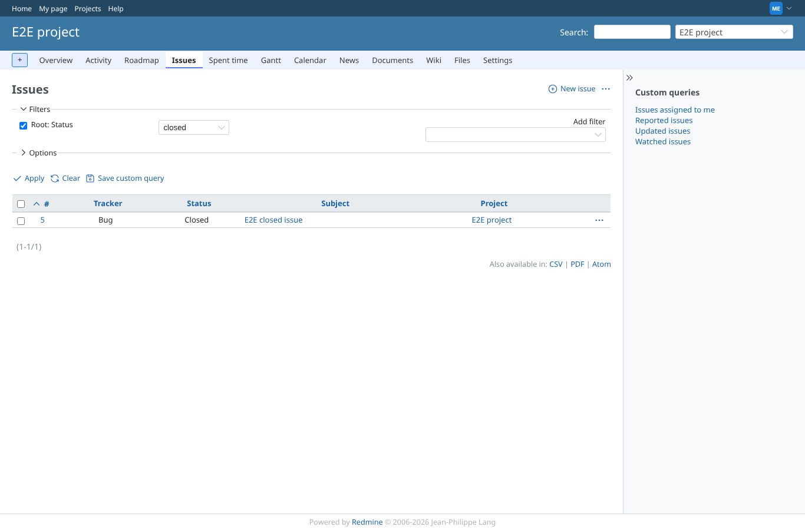
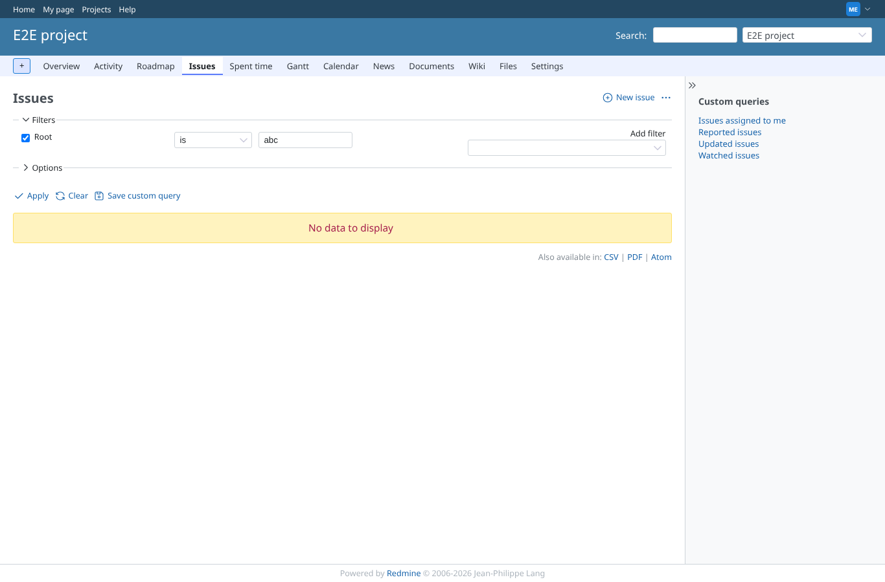
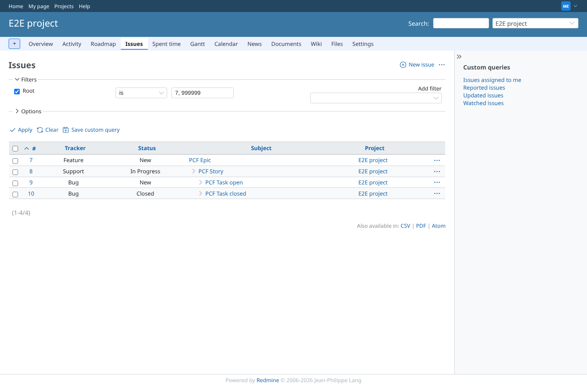
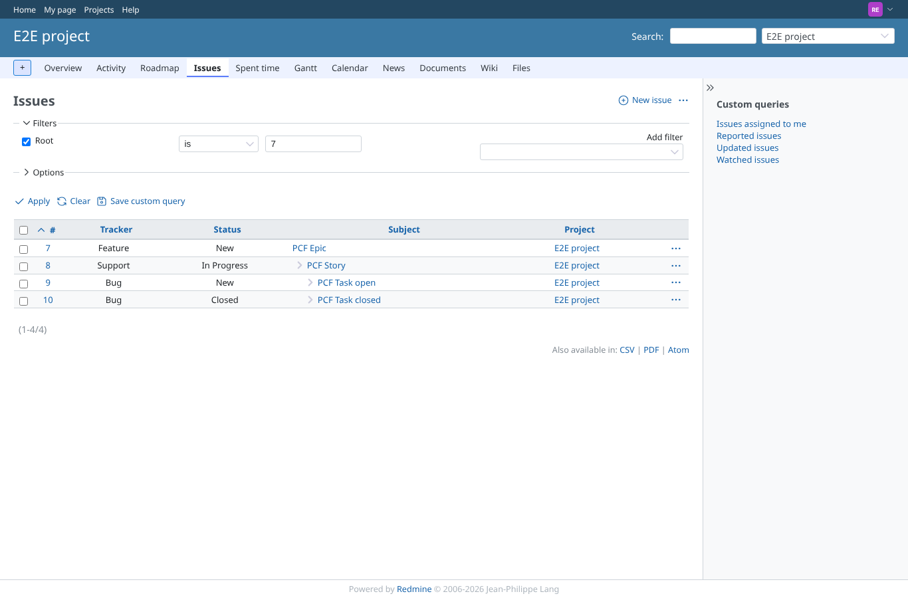

# root-filters

Run 2026-10-06T20:31:35.915Z against http://127.0.0.1:3000.

| screenshot | user | URL | shows |
|---|---|---|---|
|  | manager | `/projects/e2e-project/issues?set_filter=1&sort=id&per_page=100&c%5B%5D=tracker&c%5B%5D=status&c%5B%5D=subject&c%5B%5D=project&f%5B%5D=&f%5B%5D=root_id&op%5Broot_id%5D=%3D&v%5Broot_id%5D%5B%5D=7` | Root is #7 (PCF Epic): the epic and every issue below it, nothing else. Result: PCF Epic, PCF Story, PCF Task closed, PCF Task open. |
|  | manager | `/projects/e2e-project/issues?set_filter=1&sort=id&per_page=100&c%5B%5D=tracker&c%5B%5D=status&c%5B%5D=subject&c%5B%5D=project&f%5B%5D=&f%5B%5D=root_tracker_id&op%5Broot_tracker_id%5D=%3D&v%5Broot_tracker_id%5D%5B%5D=2` | Root: Tracker is Feature: every tree whose top is a Feature; a standalone Support issue is left out. Result: PCF Browser child, PCF Browser parent, PCF Epic, PCF Parent of hidden, PCF Silent child, PCF Silent parent, PCF Story, PCF Task closed, PCF Task open. |
|  | manager | `/projects/e2e-project/issues?set_filter=1&sort=id&per_page=100&c%5B%5D=tracker&c%5B%5D=status&c%5B%5D=subject&c%5B%5D=project&f%5B%5D=&f%5B%5D=root_tracker_id&op%5Broot_tracker_id%5D=%21&v%5Broot_tracker_id%5D%5B%5D=2` | Root: Tracker is not Feature: the epic's tree is gone, standalone Support issues remain (their own root). Result: PCF Dated, PCF Mention, PCF Standalone, PCF Watched. |
|  | manager | `/projects/e2e-project/issues?set_filter=1&sort=id&per_page=100&c%5B%5D=tracker&c%5B%5D=status&c%5B%5D=subject&c%5B%5D=project&f%5B%5D=&f%5B%5D=root_status_id&op%5Broot_status_id%5D=%3D&v%5Broot_status_id%5D%5B%5D=1` | Root: Status is New: the epic (New) and its tree, including the closed task. Result: PCF Browser child, PCF Browser parent, PCF Dated, PCF Epic, PCF Mention, PCF Parent of hidden, PCF Silent child, PCF Silent parent, PCF Standalone, PCF Story, PCF Task closed, PCF Task open, PCF Watched. |
|  | manager | `/projects/e2e-project/issues?set_filter=1&sort=id&per_page=100&c%5B%5D=tracker&c%5B%5D=status&c%5B%5D=subject&c%5B%5D=project&f%5B%5D=&f%5B%5D=root_status_id&op%5Broot_status_id%5D=c` | Root: Status closed: no PCF root is closed, so the list is empty of PCF issues. Result: no PCF issue. |
|  | manager | `/projects/e2e-project/issues?set_filter=1&sort=id&per_page=100&c%5B%5D=tracker&c%5B%5D=status&c%5B%5D=subject&c%5B%5D=project&f%5B%5D=&f%5B%5D=root_id&op%5Broot_id%5D=%3D&v%5Broot_id%5D%5B%5D=abc` | Root is "abc": not an issue id; the page answers normally and lists no PCF issue. Result: no PCF issue. |
|  | manager | `/projects/e2e-project/issues?set_filter=1&sort=id&per_page=100&c%5B%5D=tracker&c%5B%5D=status&c%5B%5D=subject&c%5B%5D=project&f%5B%5D=&f%5B%5D=root_id&op%5Broot_id%5D=%3D&v%5Broot_id%5D%5B%5D=7%2C+999999` | Root is "7, 999999": a list with an id that does not exist still finds the epic's tree. Result: PCF Epic, PCF Story, PCF Task closed, PCF Task open. |
|  | reporter | `/projects/e2e-project/issues?set_filter=1&sort=id&per_page=100&c%5B%5D=tracker&c%5B%5D=status&c%5B%5D=subject&c%5B%5D=project&f%5B%5D=&f%5B%5D=root_id&op%5Broot_id%5D=%3D&v%5Broot_id%5D%5B%5D=7` | As reporter: Root is #7 lists the same tree. Result: PCF Epic, PCF Story, PCF Task closed, PCF Task open. |
