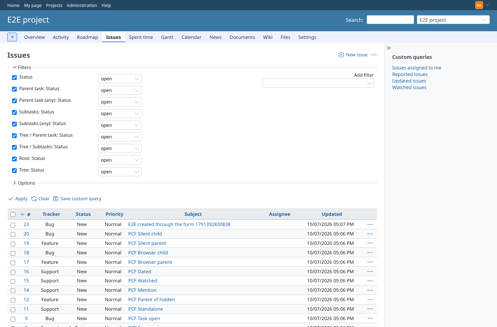
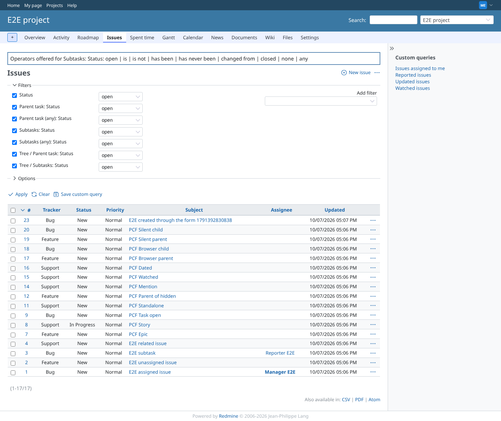
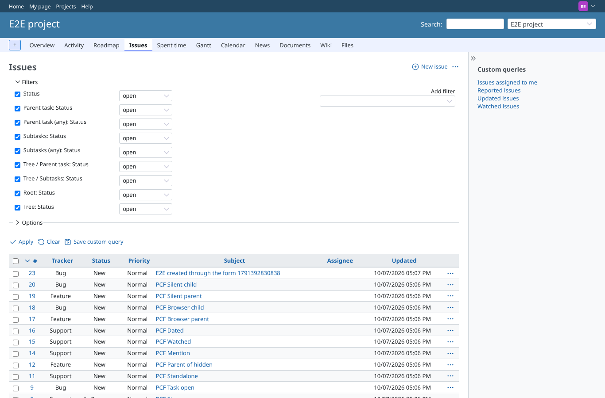
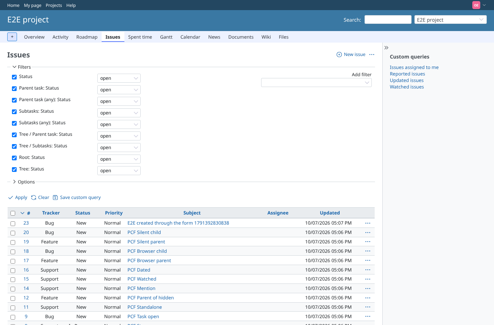
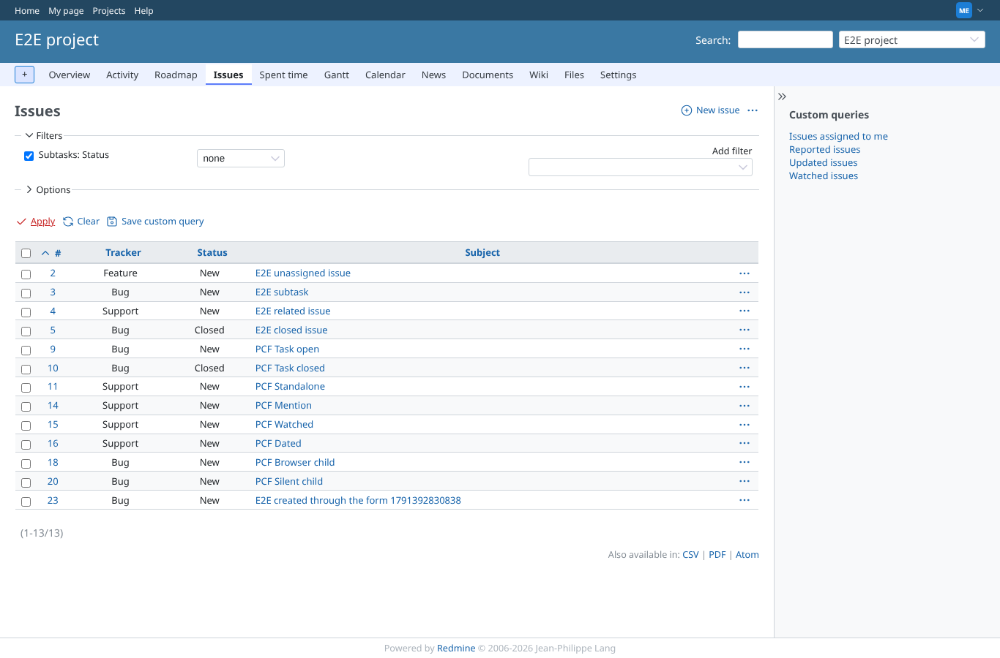
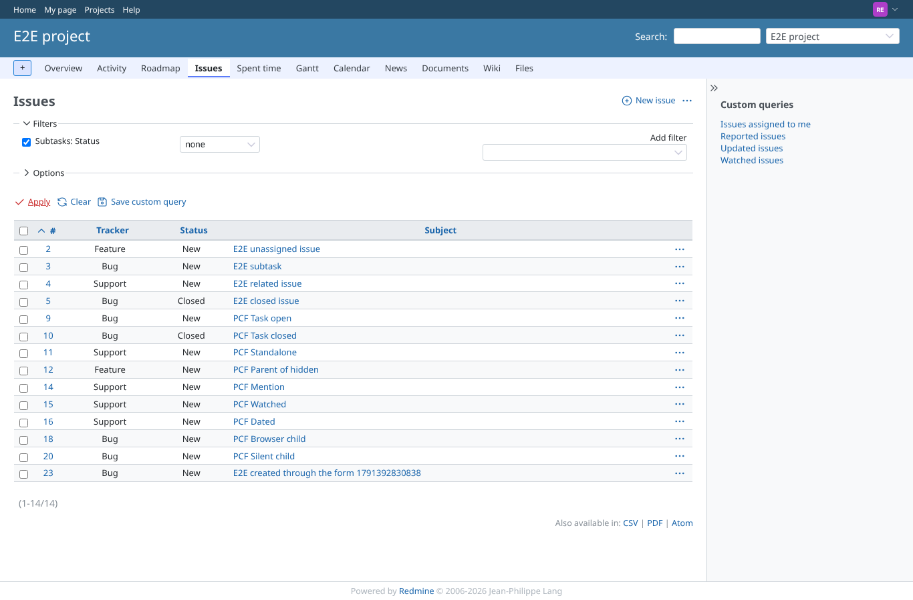
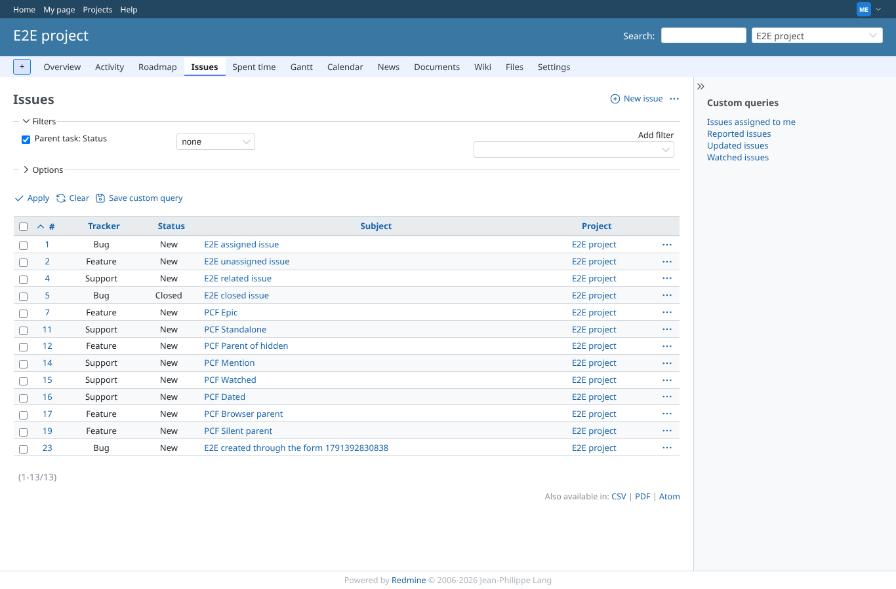
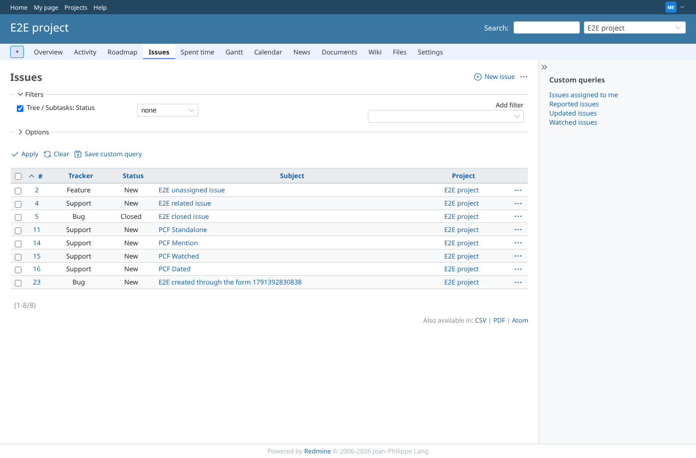
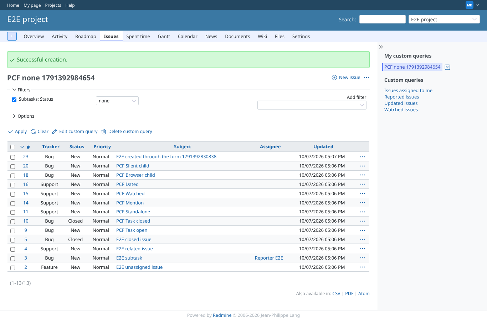

# status-none

Run 2026-10-07T17:09:47.601Z against http://127.0.0.1:3000.

| screenshot | user | URL | shows |
|---|---|---|---|
|  | admin | `/projects/e2e-project/issues` | As admin: the same six filters offer "none"; Status, Root: Status and Tree: Status do not. |
|  | manager | `/projects/e2e-project/issues` | As manager: the six status filters of a relative that may be missing, picked from the dropdown, each offer "none" (Subtasks: Status: open, is, is not, has been, has never been, changed from, closed, none, any). |
|  | reporter | `/projects/e2e-project/issues` | As reporter: the same six filters offer "none"; Status, Root: Status and Tree: Status do not. |
|  | outsider | `/projects/e2e-project/issues` | As outsider: the same six filters offer "none"; Status, Root: Status and Tree: Status do not. |
|  | manager | `/projects/e2e-project/issues?set_filter=1&sort=id&f%5B%5D=child_status_id&op%5Bchild_status_id%5D=%21*&f%5B%5D=&c%5B%5D=tracker&c%5B%5D=status&c%5B%5D=subject&group_by=&t%5B%5D=` | As manager, Subtasks: Status "none" chosen in the form and applied: issues without a subtask. "PCF Parent of hidden" is out, its subtask in the private project is visible to manager. Result: PCF Browser child, PCF Dated, PCF Mention, PCF Silent child, PCF Standalone, PCF Task closed, PCF Task open, PCF Watched. |
|  | reporter | `/projects/e2e-project/issues?set_filter=1&sort=id&f%5B%5D=child_status_id&op%5Bchild_status_id%5D=%21*&f%5B%5D=&c%5B%5D=tracker&c%5B%5D=status&c%5B%5D=subject&group_by=&t%5B%5D=` | As reporter (no access to the private project): "PCF Parent of hidden" is in, its only subtask is invisible. Result: PCF Browser child, PCF Dated, PCF Mention, PCF Parent of hidden, PCF Silent child, PCF Standalone, PCF Task closed, PCF Task open, PCF Watched. |
|  | manager | `/projects/e2e-project/issues?set_filter=1&sort=id&per_page=100&c%5B%5D=tracker&c%5B%5D=status&c%5B%5D=subject&c%5B%5D=project&f%5B%5D=&f%5B%5D=parent_status_id&op%5Bparent_status_id%5D=%21*` | Parent task: Status "none" (top level issues): the epic and the standalone issues, not the story or the tasks. Result: PCF Browser parent, PCF Dated, PCF Epic, PCF Mention, PCF Parent of hidden, PCF Silent parent, PCF Standalone, PCF Watched. |
|  | manager | `/projects/e2e-project/issues?set_filter=1&sort=id&per_page=100&c%5B%5D=tracker&c%5B%5D=status&c%5B%5D=subject&c%5B%5D=project&f%5B%5D=&f%5B%5D=tree_child_status_id&op%5Btree_child_status_id%5D=%21*` | Tree / Subtasks: Status "none": issues in no tree with a subtask, i.e. the standalone ones. Result: PCF Dated, PCF Mention, PCF Standalone, PCF Watched. |
|  | manager | `/projects/e2e-project/issues?query_id=8` | A query saved with Subtasks: Status "none" opens with "none" selected (operator box: !*). |
|  | outsider | `/projects/e2e-private/issues?set_filter=1&f[]=child_status_id&op[child_status_id]=!*` | Outsider asking the private project with Subtasks: Status "none": 403. |
