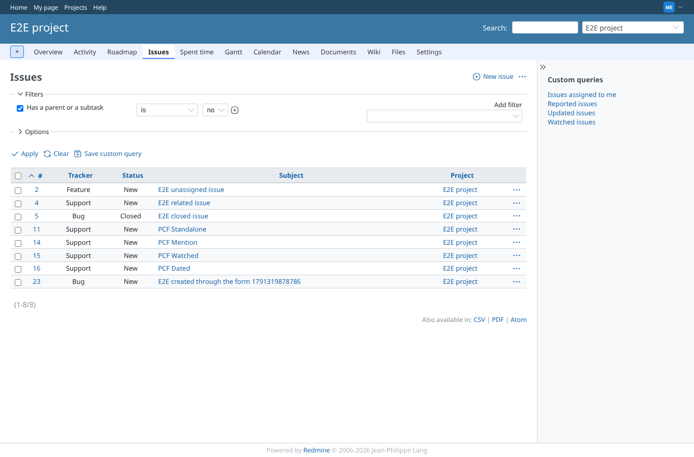
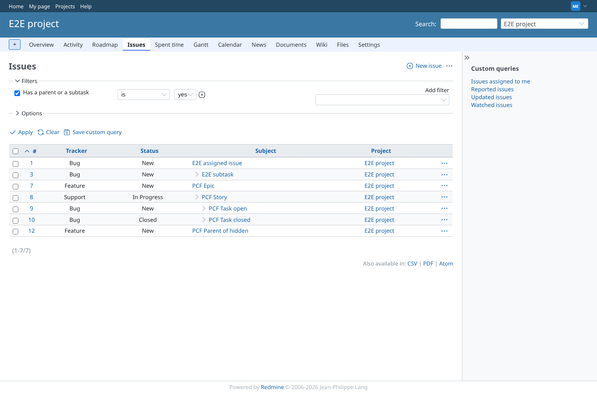
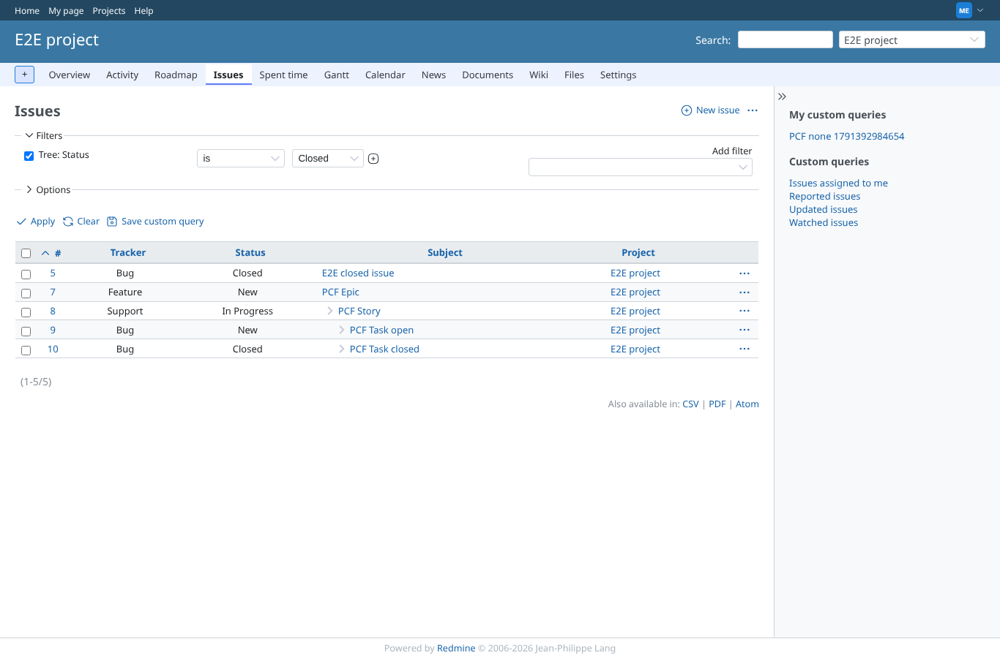
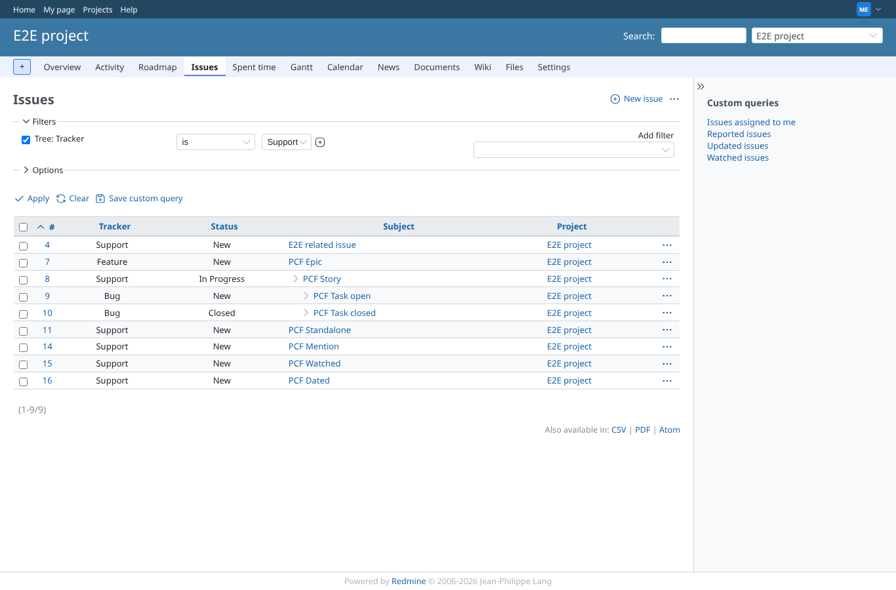
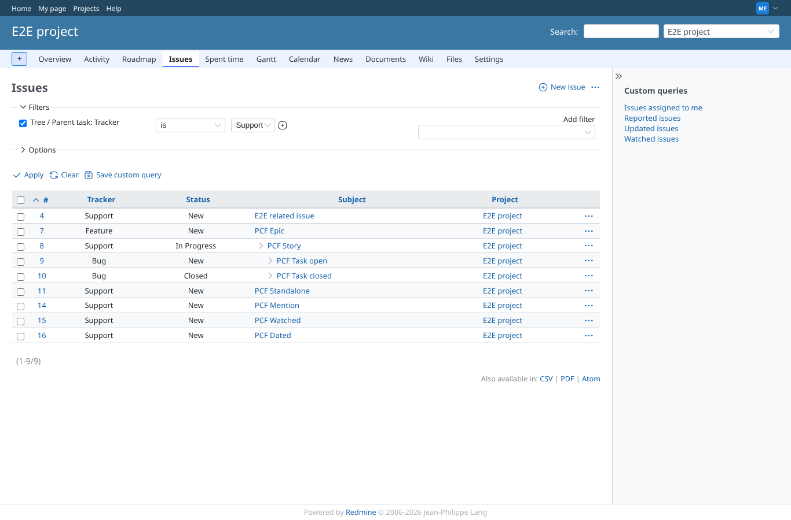
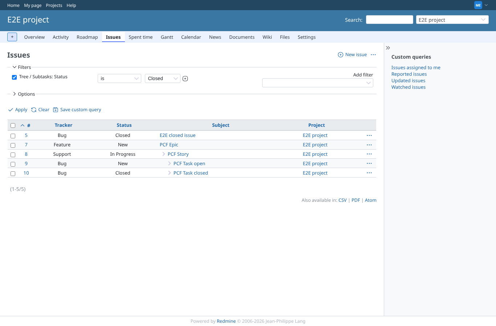
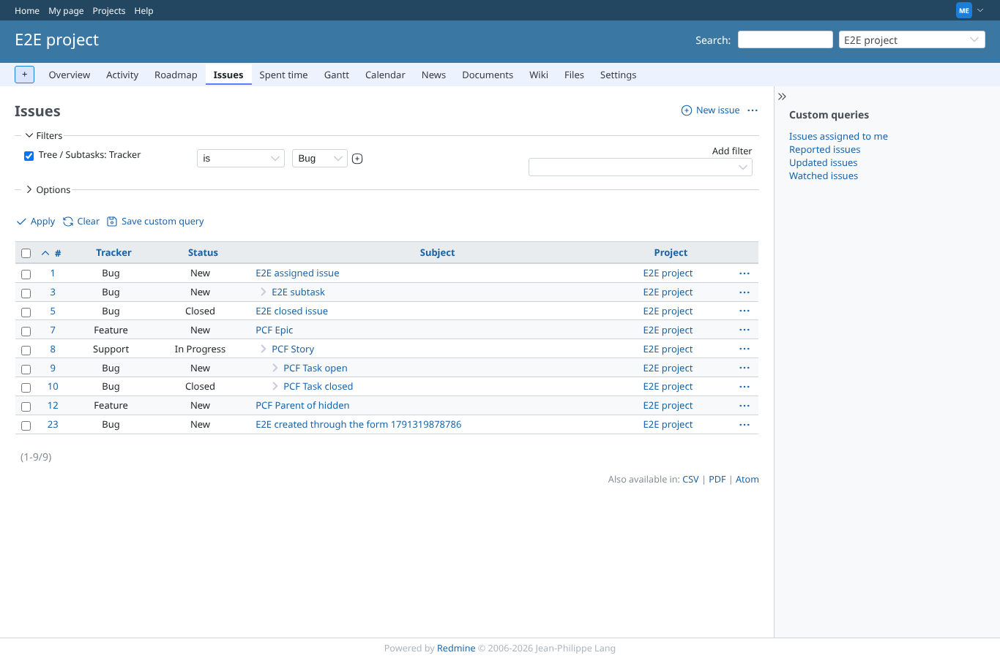
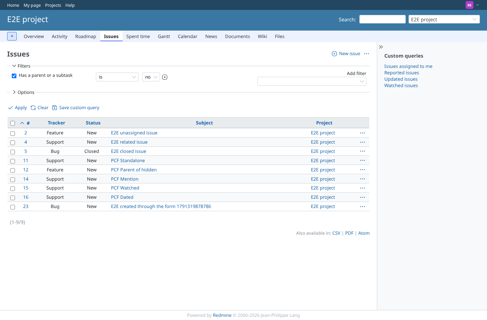
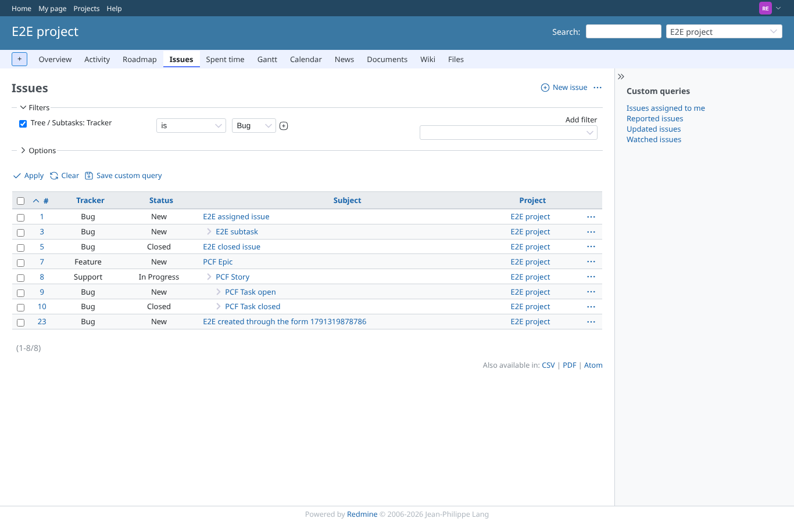
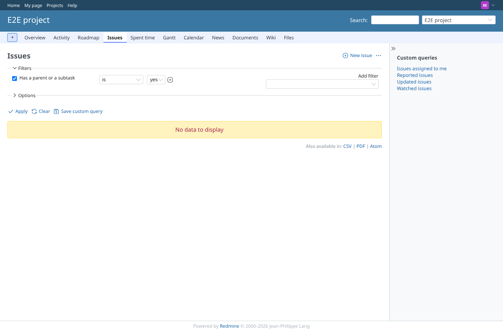

# tree-filters

Run 2026-10-06T20:53:48.961Z against http://127.0.0.1:3000.

| screenshot | user | URL | shows |
|---|---|---|---|
|  | manager | `/projects/e2e-project/issues?set_filter=1&sort=id&per_page=100&c%5B%5D=tracker&c%5B%5D=status&c%5B%5D=subject&c%5B%5D=project&f%5B%5D=&f%5B%5D=tree_has_parent_or_child&op%5Btree_has_parent_or_child%5D=%3D&v%5Btree_has_parent_or_child%5D%5B%5D=0` | Has a parent or a subtask: no — the standalone issues only. Result: PCF Dated, PCF Mention, PCF Standalone, PCF Watched. |
|  | manager | `/projects/e2e-project/issues?set_filter=1&sort=id&per_page=100&c%5B%5D=tracker&c%5B%5D=status&c%5B%5D=subject&c%5B%5D=project&f%5B%5D=&f%5B%5D=tree_has_parent_or_child&op%5Btree_has_parent_or_child%5D=%3D&v%5Btree_has_parent_or_child%5D%5B%5D=1` | Has a parent or a subtask: yes — every member of a tree, the parent of the hidden subtask included for manager. Result: PCF Epic, PCF Parent of hidden, PCF Story, PCF Task closed, PCF Task open. |
|  | manager | `/projects/e2e-project/issues?set_filter=1&sort=id&per_page=100&c%5B%5D=tracker&c%5B%5D=status&c%5B%5D=subject&c%5B%5D=project&f%5B%5D=&f%5B%5D=tree_status_id&op%5Btree_status_id%5D=%3D&v%5Btree_status_id%5D%5B%5D=5` | Tree: Status is Closed: the whole epic tree, because one of its tasks is closed. Result: PCF Epic, PCF Story, PCF Task closed, PCF Task open. |
|  | manager | `/projects/e2e-project/issues?set_filter=1&sort=id&per_page=100&c%5B%5D=tracker&c%5B%5D=status&c%5B%5D=subject&c%5B%5D=project&f%5B%5D=&f%5B%5D=tree_tracker_id&op%5Btree_tracker_id%5D=%3D&v%5Btree_tracker_id%5D%5B%5D=3` | Tree: Tracker is Support: the epic tree (its story is Support) and the standalone Support issues. Result: PCF Dated, PCF Epic, PCF Mention, PCF Standalone, PCF Story, PCF Task closed, PCF Task open, PCF Watched. |
|  | manager | `/projects/e2e-project/issues?set_filter=1&sort=id&per_page=100&c%5B%5D=tracker&c%5B%5D=status&c%5B%5D=subject&c%5B%5D=project&f%5B%5D=&f%5B%5D=tree_parent_tracker_id&op%5Btree_parent_tracker_id%5D=%3D&v%5Btree_parent_tracker_id%5D%5B%5D=3` | Tree / Parent task: Tracker is Support: the trees in which a Support issue is a parent (the epic tree), and, as documented for the tree filters, standalone Support issues; not the Feature-parent trees. Result: PCF Dated, PCF Epic, PCF Mention, PCF Standalone, PCF Story, PCF Task closed, PCF Task open, PCF Watched. |
|  | manager | `/projects/e2e-project/issues?set_filter=1&sort=id&per_page=100&c%5B%5D=tracker&c%5B%5D=status&c%5B%5D=subject&c%5B%5D=project&f%5B%5D=&f%5B%5D=tree_child_status_id&op%5Btree_child_status_id%5D=%3D&v%5Btree_child_status_id%5D%5B%5D=5` | Tree / Subtasks: Status is Closed: the trees in which a subtask is closed: the epic tree. Result: PCF Epic, PCF Story, PCF Task closed, PCF Task open. |
|  | manager | `/projects/e2e-project/issues?set_filter=1&sort=id&per_page=100&c%5B%5D=tracker&c%5B%5D=status&c%5B%5D=subject&c%5B%5D=project&f%5B%5D=&f%5B%5D=tree_child_tracker_id&op%5Btree_child_tracker_id%5D=%3D&v%5Btree_child_tracker_id%5D%5B%5D=1` | Tree / Subtasks: Tracker is Bug, as manager: the epic tree and the parent of the hidden Bug. Result: PCF Epic, PCF Parent of hidden, PCF Story, PCF Task closed, PCF Task open. |
|  | reporter | `/projects/e2e-project/issues?set_filter=1&sort=id&per_page=100&c%5B%5D=tracker&c%5B%5D=status&c%5B%5D=subject&c%5B%5D=project&f%5B%5D=&f%5B%5D=tree_has_parent_or_child&op%5Btree_has_parent_or_child%5D=%3D&v%5Btree_has_parent_or_child%5D%5B%5D=0` | As reporter: Has a parent or a subtask: no includes "PCF Parent of hidden", whose only relative is invisible to the reporter. Result: PCF Dated, PCF Mention, PCF Parent of hidden, PCF Standalone, PCF Watched. |
|  | reporter | `/projects/e2e-project/issues?set_filter=1&sort=id&per_page=100&c%5B%5D=tracker&c%5B%5D=status&c%5B%5D=subject&c%5B%5D=project&f%5B%5D=&f%5B%5D=tree_child_tracker_id&op%5Btree_child_tracker_id%5D=%3D&v%5Btree_child_tracker_id%5D%5B%5D=1` | As reporter: Tree / Subtasks: Tracker is Bug leaves the parent of the hidden Bug out. Result: PCF Epic, PCF Story, PCF Task closed, PCF Task open. |
|  | reporter | `/projects/e2e-project/issues?set_filter=1&sort=id&per_page=100&c%5B%5D=tracker&c%5B%5D=status&c%5B%5D=subject&c%5B%5D=project&f%5B%5D=&f%5B%5D=tree_has_parent_or_child&op%5Btree_has_parent_or_child%5D=%3D&v%5Btree_has_parent_or_child%5D%5B%5D=maybe` | Failure path: Has a parent or a subtask = "maybe" from the URL: the page answers normally, no PCF issue. Result: no PCF issue. (The value box shows its first option: the value from the URL is not one of them.) |
